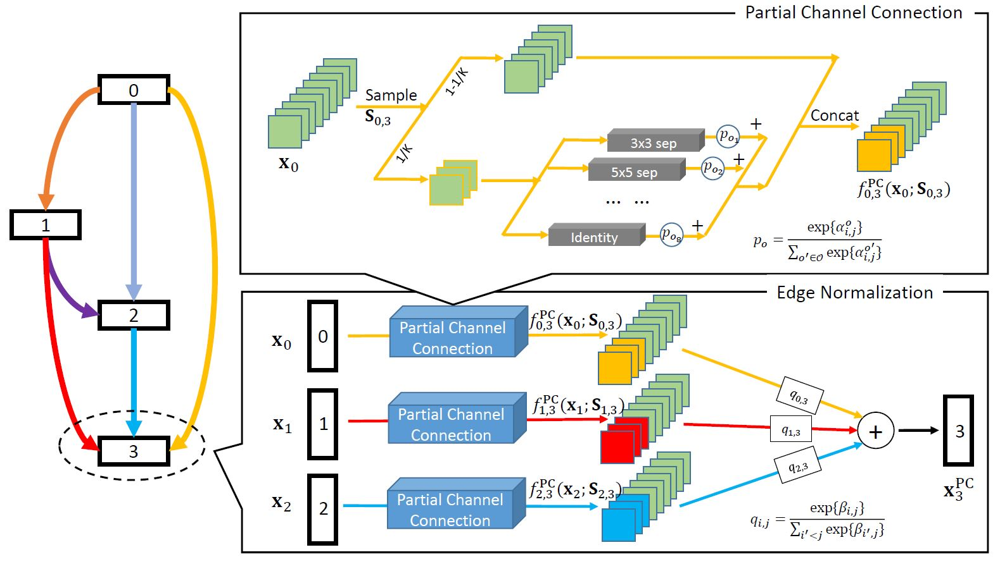
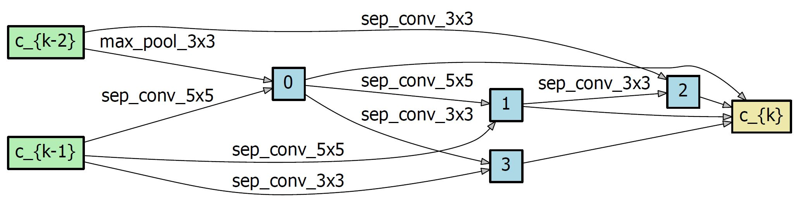

# [pcdarts-tf2](https://github.com/peteryuX/pcdarts-tf2)

[](https://lgtm.com/projects/g/peteryuX/pcdarts-tf2/context:python)


:fire: PC-DARTS (PC-DARTS: Partial Channel Connections for Memory-Efficient Differentiable Architecture Search, published in ICLR 2020) implemented in Tensorflow 2.0+. This is an unofficial implementation. :fire:

> PC-DARTS is a memory efficient differentiable architecture search method, which can be trained with a larger batch size and, consequently, enjoys both faster speed and higher training stability. Experimental results achieve an error rate of **2.57%** on CIFAR10 with merely **0.1 GPU-days** for architecture search.

Original Paper: &nbsp; [Arxiv](https://arxiv.org/abs/1907.05737) &nbsp; [OpenReview](https://openreview.net/forum?id=BJlS634tPr)

Offical Implementation: &nbsp; [PyTorch](https://github.com/yuhuixu1993/PC-DARTS)

<p align="center">
    
</p>

****

## Contents
:bookmark_tabs:

* [Installation](#Installation)
* [Usage](#Training-and-Testing)
* [Benchmark](#Benchmark)
* [Models](#Models)
* [References](#References)

***

## Installation
:pizza:

Create a new python virtual environment by [Anaconda](https://www.anaconda.com/) or just use pip in your python environment and then clone this repository as following.

### Clone this repo
```bash
git clone https://github.com/peteryuX/pcdarts-tf2.git
cd pcdarts-tf2
```

### Conda
```bash
conda env create -f environment.yml
conda activate pcdarts-tf2
```

### Pip

```bash
pip install -r requirements.txt
```

****

## Usage
:lollipop:

### Config File
You can modify your own dataset path or other settings of model in [./configs/*.yaml](https://github.com/peteryuX/pcdarts-tf2/tree/master/configs) for training and testing, which would like below.

```python
# general setting
batch_size: 128
input_size: 32
init_channels: 36
layers: 20
num_classes: 10
auxiliary_weight: 0.4
drop_path_prob: 0.3
arch: PCDARTS
sub_name: 'pcdarts_cifar10'
using_normalize: True

# training dataset
dataset_len: 50000  # number of training samples
using_crop: True
using_flip: True
using_cutout: True
cutout_length: 16

# training setting
epoch: 600
init_lr: 0.025
lr_min: 0.0
momentum: 0.9
weights_decay: !!float 3e-4
grad_clip: 5.0

val_steps: 1000
save_steps: 1000
```

Note:
- The `sub_name` is the name of outputs directory used in checkpoints and logs folder. (make sure of setting it unique to other models)
- The `save_steps` is the number interval steps of saving checkpoint file.
- The [./configs/pcdarts_cifar10_search.yaml](https://github.com/peteryuX/pcdarts-tf2/tree/master/configs/pcdarts_cifar10_search.yaml) and [./configs/pcdarts_cifar10.yaml](https://github.com/peteryuX/pcdarts-tf2/tree/master/configs/pcdarts_cifar10.yaml) are used by [train_search.py](https://github.com/peteryuX/pcdarts-tf2/tree/master/train_search.py) and [train.py](https://github.com/peteryuX/pcdarts-tf2/tree/master/train.py) respectively, which have different settings for small proxy model training(architecture searching) and full-size model training. Please make sure you use the correct config file in related script. (The example yaml script above is [./configs/pcdarts_cifar10.yaml](https://github.com/peteryuX/pcdarts-tf2/tree/master/configs/pcdarts_cifar10.yaml).)

### Architecture Searching on CIFAR-10 (using small proxy model)

**Step1**: Search cell architecture on CIFAR-10 using small proxy model.

```bash
python train_search.py --cfg_path="./configs/pcdarts_cifar10_search.yaml" --gpu=0
```

Note:
- The `--gpu` is used to choose the id of your avaliable GPU devices with `CUDA_VISIBLE_DEVICES` system varaible.
- You can visualize the training status on tensorboard by running "`tensorboard --logdir=./logs/`". My logs can be found from [search_log](https://tensorboard.dev/experiment/SWu96NYrSlyIk7VRmCqjgw/) and [full_train_log](https://tensorboard.dev/experiment/lyI64MKgRAODUqv3V4rzjg/).
- You can visualize the learning rate scheduling by running "`python ./modules/lr_scheduler.py`".
- You can visualize the dataset augmantation by running "`python ./dataset_checker.py`".

**Step2**: After the searching completed, you can find the result genotypes in `./logs/{sub_name}/search_arch_genotype.py`. Open it and copy the latest genotype into the [./modules/genotypes.py](https://github.com/peteryuX/pcdarts-tf2/tree/master/modules/genotypes.py), which will be used for further training later. The genotype like bellow:

```python
TheNameYouWantToCall = Genotype(
    normal=[
        ('sep_conv_3x3', 1),
        ('skip_connect', 0),
        ('sep_conv_3x3', 0),
        ('dil_conv_3x3', 1),
        ('sep_conv_5x5', 0),
        ('sep_conv_3x3', 1),
        ('avg_pool_3x3', 0),
        ('dil_conv_3x3', 1)],
    normal_concat=range(2, 6),
    reduce=[
        ('sep_conv_5x5', 1),
        ('max_pool_3x3', 0),
        ('sep_conv_5x5', 1),
        ('sep_conv_5x5', 2),
        ('sep_conv_3x3', 0),
        ('sep_conv_3x3', 3),
        ('sep_conv_3x3', 1),
        ('sep_conv_3x3', 2)],
    reduce_concat=range(2, 6))
```

Note:
- You can visualize the genotype by running "`python ./visualize_genotype.py TheNameYouWantToCall`".
<p align="center">
    
    
</p>

### Training on CIFAR-10 (using full-sized model)

**Step1**: Make sure that you already modifed the flag `arch` in [./configs/pcdarts_cifar10.yaml](https://github.com/peteryuX/pcdarts-tf2/tree/master/configs/pcdarts_cifar10.yaml) to match the genotype you want to use in [./modules/genotypes.py](https://github.com/peteryuX/pcdarts-tf2/tree/master/modules/genotypes.py). 

Note:
- The default flag `arch` (`PCDARTS`) is the genotype proposed by official paper. You can train this model by yourself, or use dowload it from [BenchmarkModels](#Models).

**Step2**: Train the full-sized model on CIFAR-10 with specific genotype.

```bash
python train.py --cfg_path="./configs/pcdarts_cifar10.yaml" --gpu=0
```

### Testing on CIFAR-10 (using full-sized model)

To evaluate the full-sized model with the corresponding cfg file on the testing dataset. You can also download my trained model for testing from [Models](#Models) without training it yourself, which default `arch` (`PCDARTS`) is the best cell proposed in paper.

```bash
python test.py --cfg_path="./configs/pcdarts_cifar10.yaml" --gpu=0
```

****

## Benchmark
:coffee:

### Results on CIFAR-10
| Method | Search Method | Params(M) | Test Error(%)| Search-Cost(GPU-days) |
| ------ | ------------- | --------- | ------------ | --------------------- |
| [NASNet-A](https://arxiv.org/abs/1611.01578) | RL | 3.3 | 2.65 | 1800 |
| [AmoebaNet-B](https://arxiv.org/abs/1802.01548) | Evolution | 2.8 | 2.55 | 3150 |
| [ENAS](https://arxiv.org/abs/1802.03268) | RL | 4.6 | 2.89 | 0.5 |
| [DARTSV1](https://arxiv.org/abs/1806.09055) | gradient-based | 3.3 | 3.00 | 0.4 |
| [DARTSV2](https://arxiv.org/abs/1806.09055) | gradient-based | 3.3 | 2.76 | 1.0 |
| [SNAS](https://arxiv.org/abs/1812.09926)    | gradient-based | 2.8 | 2.85 | 1.5 |
| [PC-DARTS](https://github.com/yuhuixu1993/PC-DARTS) (official PyTorch version) | gradient-based | 3.63 | **2.57** | **0.1** |
| PC-DARTS TF2 (paper architecture) | gradient-based | 3.63 | 2.73 | - |
| PC-DARTS TF2 (searched by myself) | gradient-based | 3.56 | 2.88 | 0.12 |

Note:
- Above results are referenced from [official repository](https://github.com/yuhuixu1993/PC-DARTS) and [orignal paper](https://arxiv.org/abs/1907.05737).
- There still have a slight performance gap between my PC-DARTS TF2 and official version. In both cases, we used Nvidia 1080ti (11G memory). My PC-DARTS TF2 pre-trained model can be found in [Models](#Models).
- My tensorboard logs can be found from [search_log](https://tensorboard.dev/experiment/SWu96NYrSlyIk7VRmCqjgw/) and [full_train_log](https://tensorboard.dev/experiment/lyI64MKgRAODUqv3V4rzjg/).
- If you get unsatisfactory results with the archecture searched by yourself, you might try to search it more than one time. (see the discussions [here](https://github.com/yuhuixu1993/PC-DARTS/issues/7))

****

## Models
:doughnut:

Dowload these models bellow, then extract them into `./checkpoints/` for restoring.

| Model Name          | Config File | `arch` | Download Link |
|---------------------|-------------|--------|---------------|
| PC-DARTS (CIFAR-10, paper architecture) | [pcdarts_cifar10.yaml](https://github.com/peteryuX/pcdarts-tf2/tree/master//configs/pcdarts_cifar10.yaml) | `PCDARTS` | [GoogleDrive](https://drive.google.com/file/d/1BhLlktX78z90yOaORXvch_GAnIWWkYrX/view?usp=sharing) |
| PC-DARTS (CIFAR-10, searched by myself) | [pcdarts_cifar10_TF2.yaml](https://github.com/peteryuX/pcdarts-tf2/tree/master//configs/pcdarts_cifar10_TF2.yaml) | `PCDARTS_TF2_SEARCH` | [GoogleDrive](https://drive.google.com/file/d/1UgeZzEnQZ6oeMKpr01rEDflVi9X1dzeq/view?usp=sharing) |

Note:
- You can find the training settings of the models in the corresponding [./configs/*.yaml](https://github.com/peteryuX/pcdarts-tf2/tree/master/configs) files, and make sure that the `arch` flag in it is matched with the genotypes name in [./modules/genotypes.py](https://github.com/peteryuX/pcdarts-tf2/tree/master/modules/genotypes.py).
- **Based on the property of the training dataset, all the pre-trained models can only be used for non-commercial applications.**

****

## References
:hamburger:

Thanks for these source codes porviding me with knowledges to complete this repository.

- https://github.com/yuhuixu1993/PC-DARTS (Official)
    - PC-DARTS:Partial Channel Connections for Memory-Efficient Differentiable Architecture Search
- https://github.com/quark0/darts
    - Differentiable architecture search for convolutional and recurrent networks https://arxiv.org/abs/1806.09055
- https://github.com/zzh8829/yolov3-tf2
    - YoloV3 Implemented in TensorFlow 2.0
